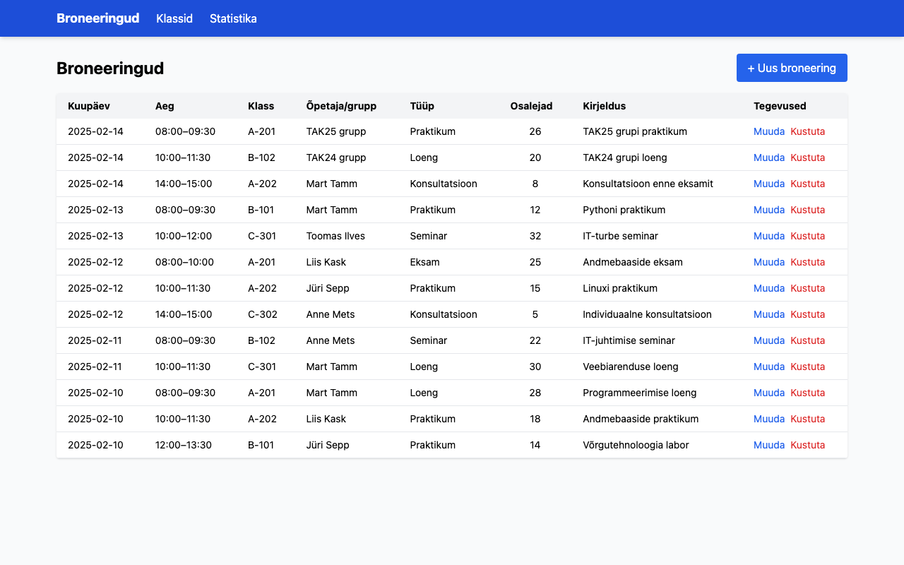
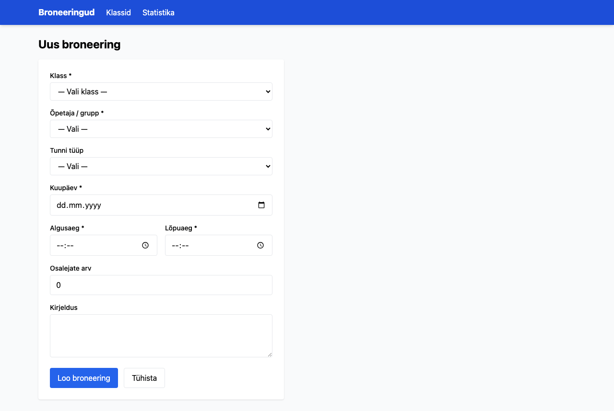
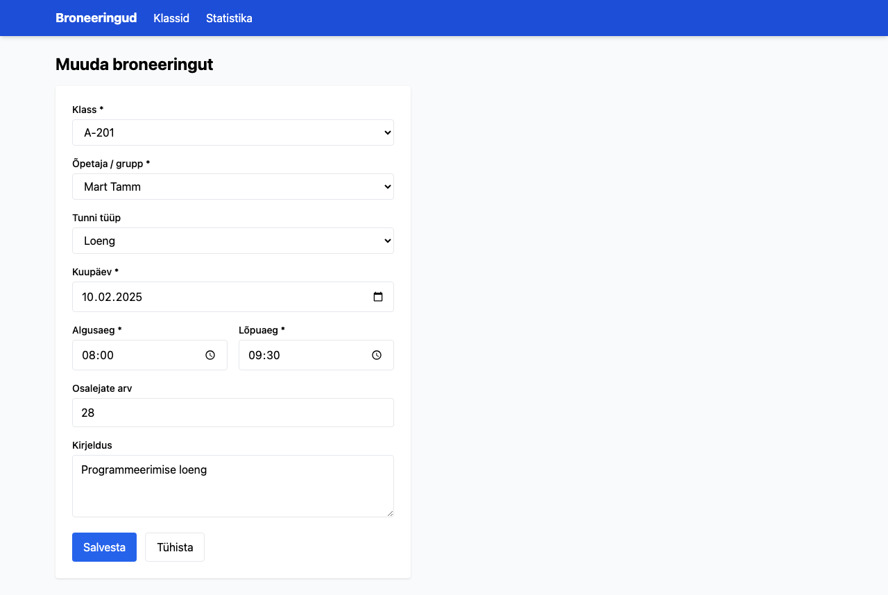
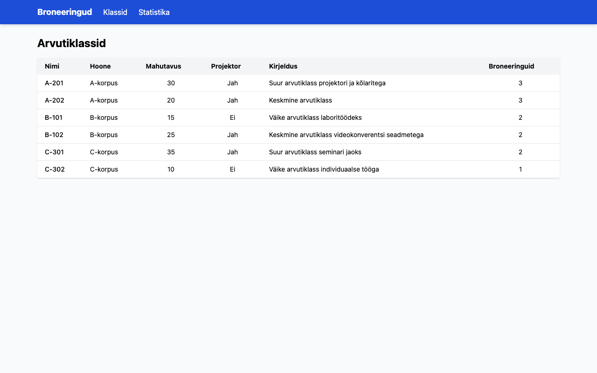
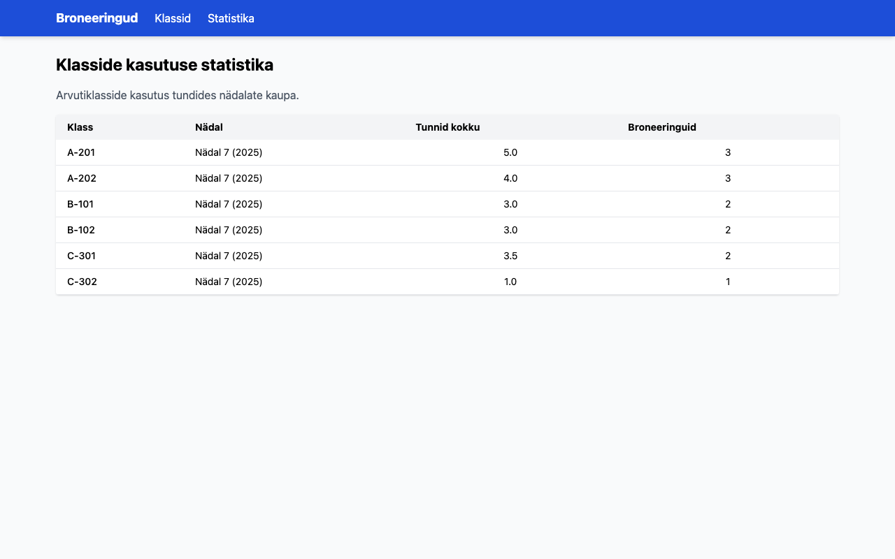

# Arvutiklasside broneerimissüsteem

TAK25 grupi andmebaasirakenduse projekt. Veebirakendus arvutiklasside broneerimiseks.

**Tehnoloogiad:** PostgreSQL, Bun, Hono, HTMX, Tailwind CSS

## Projekti struktuur

```
├── schema.sql              # Andmebaasi skeem (4 tabelit)
├── seed.sql                # Näidisandmed
├── logical_design.md       # Loogiline disaini kirjeldus
├── permissions.sql         # Rollid ja õigused
├── permissions.md          # Õiguste selgitus
├── app/                    # Veebirakendus (Bun + Hono)
├── import/                 # Andmete import (CSV, JSON, XML)
├── export/                 # Andmete eksport
└── backup/                 # Varundamine ja taastamine
```

## Kiirstart

```bash
# 1. Andmebaas
createdb arvutiklassid
psql -d arvutiklassid -f schema.sql
psql -d arvutiklassid -f seed.sql

# 2. Rakendus
cd app
bun install
bun run dev
```

Server käivitub aadressil **http://localhost:3000**.

## Import / Eksport

```bash
# Impordi andmed CSV, JSON ja XML failidest
bun run import/import.ts

# Ekspordi koondandmed
bun run export/export.ts
```

## Õigused ja varundamine

```bash
# Loo rollid (admin, viewer)
psql -d arvutiklassid -f permissions.sql

# Loo varukoopia
bash backup/backup.sh
```

## Ekraanipildid

### Broneeringute nimekiri


### Uue broneeringu vorm


### Broneeringu muutmine


### Arvutiklassid


### Statistika

