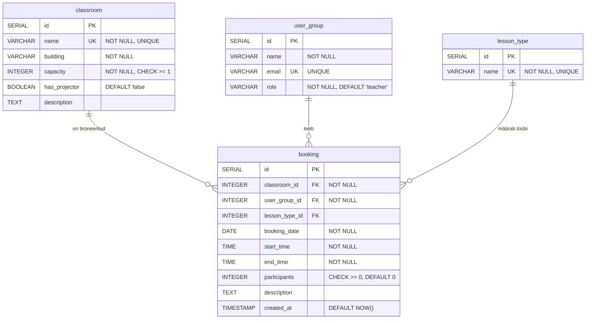

# ERD — Crow's Foot notatsioon

## Seosed

| Seos | Kardinaalsus | Selgitus |
|------|-------------|----------|
| classroom → booking | 1:N | Üht klassi saab broneerida mitu korda |
| user_group → booking | 1:N | Üks kasutaja/grupp teeb mitu broneeringut |
| lesson_type → booking | 1:N (valikuline) | Tunnitüüp võib olla määramata (NULL) |
