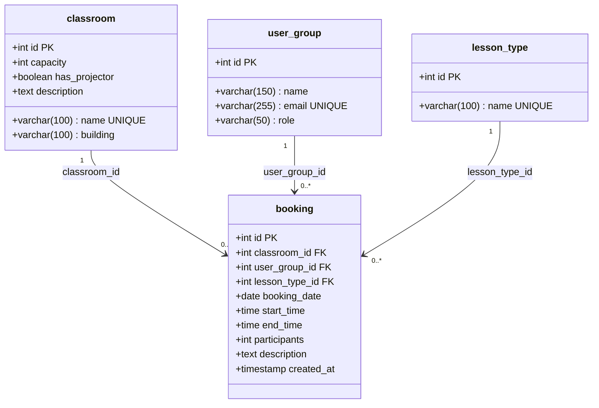

# UML klassidiagramm

## Piirangud

| Tabel | Piirang | Tüüp |
|-------|---------|------|
| classroom | `capacity >= 1` | CHECK |
| booking | `end_time > start_time` | CHECK |
| booking | `participants >= 0` | CHECK |
| booking | `classroom_id → classroom(id)` | FK, ON DELETE CASCADE |
| booking | `user_group_id → user_group(id)` | FK, ON DELETE CASCADE |
| booking | `lesson_type_id → lesson_type(id)` | FK, ON DELETE SET NULL |
